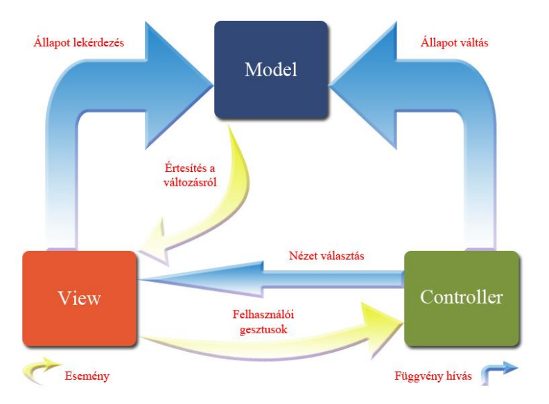

# Rendszerterv

## A rendszer célja

Egy egyszerű weboldal létrehozása, ami egy gomb megnyomására kér egy viccet a backend adatbázístóé és megjeleníti a képernyőn. Továbbá ezt a viccet a felhasználó értékelheti és egy leader board oldalon megtekintheti a viccek értékelését.

---

## Projekt terv

### Projektszerepkörök, felelősségek
Frontend interface fejlesztő, Frontend Javascript fejlesztő, Backend python+flask fejlesztő, Backend adatbázis fejlesztő
### Projektmunkások és felelősségeik
Kondor Kristóf-Frontend interface fejlesztő, Sebestyén Bence-Backend python+flask fejlesztő, Kacsó Melinda-Backend adatbázis fejlesztő, Nyiri László-Frontend Javascript

---

## Üzleti folyamatok modellje

### Üzleti szereplők
Felhasználó
### Üzleti folyamatok
A felhasználó gombbal kérhet viccet és gombok segítségével értékelheti a viccet. 
### Üzleti entitások
Viccek adatbázis ami tartalmazza a viccet és értékelését.

---

## Követelmények

### Funkcionális követelmények
Vicc betöltése, vicc értékelése, viccek listázása értékelés szerint
### Nemfunkcionális követelmények
Jó olvashatóság több fajta méretü eszközön. Gyors betöltési idő

---

## Funkcionális terv

### Rendszerszereplők
Felhasználó, rendszeradminisztrátor
### Rendszerhasználati esetek és lefutásaik
1. Vicc kérése: A felhasználó gomb nyomására kér viccet, ami az oldal javascript segítségével kér a backend-től és az ad egy random viccet az adatbázisból.
2. Vicc értékelése: A felhasználó értékeli egy like vagy dislike gomb nyomására, az oldal ennek hatására jelez a backend-nek hogy az adatbázisban növelje vagy csökkentse az értékelés szintjét.
3. Vicc toplista: A felhasználó megtekinti a viccek listáját értékelés alapján csökkentve rendezve. Ezt a backend adatbázistól kéri le.
### Határosztályok
Ha nincs vicc, vagy nem fér hozzá az adatbázishoz az oldal akkor ezt hibával jelezzük a felhasználó felé.
### Menü-hierarchiák
A felhasználó először a main-page csatlakozik, ahol talál egy generálás gombot, a viccet, értékelési gombokat és egy hyperlinket a leaderboard-page -re. A leaderboard-page tartalmaz egy listát és egy hyperlinket vissza a main-page -re.

---

## Fizikai környezet

### Vásárolt softwarekomponensek és külső rendszerek

A projektben nincs szükség külső szoftverkomponensek vagy szolgáltatások vásárlására.

### Hardver és hálózati topológia

A rendszer működéséhez nincs szükség dedikált fizikai szerverre vagy külön hardverbeszerzésre.  
A **backend** a Flask keretrendszerrel futtatva lokálisan működik, a **felhasználói felület** webböngészőből (pl. Chrome, Firefox) érhető el.  
Az **adatbázis** a Railway MySQL szolgáltatásban található, amely felhőalapú megoldásként biztosítja a szükséges erőforrásokat és távoli elérhetőséget.  

A hálózati architektúra egyszerű kliens–szerver modellre épül:  
1. A felhasználó webböngészője kapcsolódik a Flask backendhez.
2. A Flask szerver HTTP kéréseken keresztül kommunikál a Railway MySQL adatbázissal.
3. Az adatbázis interneten keresztül érhető el, biztonságos, titkosított kapcsolaton.

### Fizikai alrendszerek

A rendszer működését az alábbi fizikai komponensek biztosítják:

- **Felhasználói eszközök:** számítógépek, laptopok vagy okostelefonok, amelyek webböngészőt futtatnak, és ezen keresztül érik el az alkalmazást.
- **Fejlesztői környezet:** a csapattagok számítógépei, ahol a Flask alkalmazás lokálisan fut és tesztelhető.
- **Adatbázis szerver:** a Railway által biztosított felhőalapú MySQL szolgáltatás, amely a szolgáltató adatközpontjában elhelyezett fizikai szervereken fut.

### Fejlesztő eszközök

A projekt fejlesztéséhez az alábbi eszközöket és technológiákat használjuk:

- **Programozási nyelvek**:
  - **HTML/CSS**: A frontend megjelenítéséhez és dizájnhoz.
  - **JavaScript**: A dinamikus interakciók és az API-k kezelése a frontend oldalon.
  - **Python**: A backend logika, adatbázis-kezelés és API-k fejlesztéséhez.

- **Adatbázis**: Railway MySQL
  
- **Verziókezelés**:
  - **Git**: A kód nyomon követésére és kezelésére, amely lehetővé teszi a csapat számára a párhuzamos munkát és a könnyű kódmegosztást.

### Keretrendszer (pl. Spring)

A backend fejlesztéséhez a **Flask** keretrendszert használjuk, amely lehetővé teszi a gyors és egyszerű webes API-k fejlesztését. A Flask kezeli a viccek betöltését az adatbázisból, a felhasználói **like** és **dislike** értékelések tárolását, valamint a **toplista** dinamikus frissítését. Az alkalmazás RESTful API-t biztosít, amely lehetővé teszi a viccek és azok értékeléseinek lekérését, illetve az aktuális rangsor megjelenítését.

---

## Absztrakt domain modell

### Domain specifikáció, fogalmak
Rendszeradminisztrátor: Az a személy aki a vicc adatbázis tartalmáért felelős.

Felhasználó: A végfelhasználó aki vicceket kér és értekeli őket.

Vicc: A vicc amit a felhasználók kérnek és értékelnek. Tartalmaz setup, punchline, kategória és értekelést.

Érékelés: Egy numerikus szám ami nagyobb minnél több pozitív értékelést kapott. Ez a szám mehet minuszba is ha több negatív értékelést kapott mint pozitívat.

Leaderboard: Az összes vicc és hozzátartozó értékelési szám.

### Absztrakt komponensek, ezek kapcsolatai
#### Felhasználói interakciók

A felhasználó az, aki a rendszer egyik fő komponense, és az alábbi interakciók révén éri el a kívánt szolgáltatásokat:
Viccek kérése:

A felhasználó kér egy viccet, ami a vicc generátort aktiválja. A vicc generátor visszaad egy viccet a rendszernek.

Viccek értékelése:

A felhasználó pontozza a viccet. Az értékelő rendszer tárolja és frissíti a vicc pontszámát.

Leaderboard megtekintése:

A felhasználó megtekintheti a leaderboardot, amely a legjobb viccek rangsorát mutatja. A leaderboard az összesített értékelések alapján frissül.

#### Háttérlogika

#### Adatbázis

---

## Architekturális terv

### Egy architekturális tervezési minta (pl. MVC, 3-rétegű alkalmazás, …)

A projekt a **Model-View-Controller (MVC)** tervezési mintát követi, amely segít elkülöníteni az alkalmazás különböző részeit és átláthatóbbá tenni a fejlesztést.

### Az alkalmazás rétegei, fő komponensei, ezek kapcsolatai

### Model (Adatmodell)

**Feladata:** az adatbázissal való kommunikáció.  

- A viccek és azok like/dislike értékei itt kerülnek tárolásra és lekérdezésre.  
- A MySQL adatbázisban tárolt vicceket a **Python Flask** backend olvassa ki, és frissíti a like/dislike értékeket.

### View (Nézet / UI)

**Feladata:** a felhasználó számára megjeleníteni az adatokat.  

- A **HTML/CSS** biztosítja az oldal felépítését és stílusát.  
- A **JavaScript** dinamikusan frissíti a viccek megjelenítését és a leaderboardot.  
- Példa: amikor a felhasználó rákattint a **“Generate”** gombra, a View frissül az új vicc megjelenítésével.

### Controller (Vezérlő / Logika)

**Feladata:** összekapcsolni a Modelt és a View-t.  

- A **Python Flask** backend kezeli a felhasználói kéréseket (pl. új vicc generálása, like/dislike mentése), lekéri az adatokat a Modelből, majd visszaküldi a View-nak a megjelenítésre.  
- A **JavaScript** részt vesz a kliens oldali interakciók kezelésében.

| Csapattag         | Használt technológiák      | Feladat |
|------------------|---------------------------|---------|
| **Kondor Kristóf** | `HTML`, `CSS`             | **View** megvalósítása |
| **Nyiri László**   | `JavaScript`              | **View** dinamikus viselkedése, kliens oldali kommunikáció a **Controller**-rel |
| **Sebestyén Bence**| `Python, Flask`            | **Controller**, backend logika, API végpontok |
| **Kacsó Melinda**  | `Railway MySQL`           | **Model**, viccek és értékelések tárolása |

### Változások kezelése

- **Új funkciók hozzáadása:** Az új gombok, menük vagy statisztikák könnyen integrálhatók a frontendbe és backendbe, anélkül, hogy a meglévő logikát megsértenénk.  
- **Adatbázis bővítése:** A MySQL adatbázis struktúrája moduláris, így új mezők vagy táblák hozzáadása a modelhez minimális hatással van a Controller és View rétegekre.  
- **Technológiai frissítések:** A frontend és backend komponensek különválasztása lehetővé teszi a technológiák (pl. JavaScript könyvtárak, Flask verzió) cseréjét anélkül, hogy az egész rendszert újra kellene írni.  
- **Verziókezelés** (Git) biztosítja a kód és a konfigurációk változásainak nyomon követését.

### Rendszer bővíthetősége

A viccportál architektúrája lehetővé teszi, hogy **könnyen bővíthető legyen új funkciókkal** a jövőben. A rétegek külön-külön fejleszthetők, minimális hatással a többi komponensre.

- **Új vicctípusok vagy kategóriák:** Új mezők vagy táblák hozzáadhatók a MySQL adatbázishoz anélkül, hogy a meglévő adatkezelést zavarnák.  
- **Frontend funkciók bővítése:** Új gombok, menük vagy vizuális elemek integrálása a View rétegbe egyszerűen megvalósítható, a meglévő logika változtatása nélkül.  
- **Backend logika bővítése:** Új API végpontok vagy üzleti logika hozzáadása a Flask Controller rétegbe a meglévő működés mellett.  
- **Technológiai moduláris bővítés:** A rendszer rétegeinek elkülönítése lehetővé teszi új könyvtárak, keretrendszerek vagy szolgáltatások integrálását a jövőben.

### Biztonsági funkciók

---

## Adatbázis terv

### Logikai adatmodell

### Tárolt eljárások

### Fizikai adatmodellt legeneráló SQL szkript

---

## Implementációs terv

### Perzisztencia-osztályok

### Üzleti logika osztályai

### Kliensoldal osztályai

---

## Tesztterv

---

## Telepítési terv

---

## Karbantartási terv
